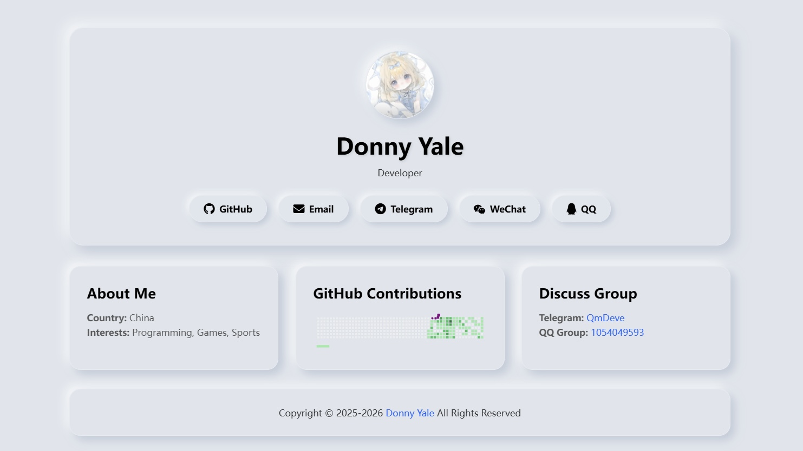
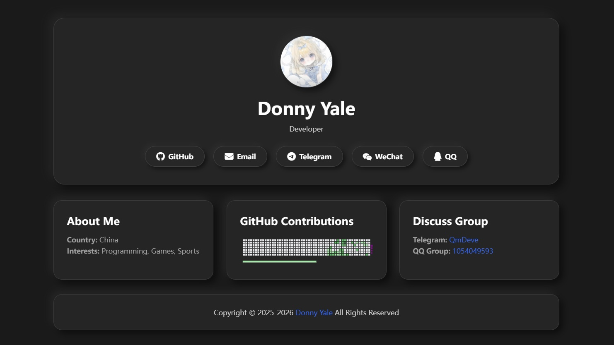

<div align="center">

## Personal Homepage
**Neumorphism Style's Personal Homepage Website Source Code**

[](https://GitHub.com/QmDeve/personal-homepage)
[](https://opensource.org/licenses/Apache-2.0)

[](https://t.me/QmDeve)
[](https://qm.qq.com/q/NBHRYhce4y)

</div>

### Features
- Personal homepage with Neumorphism design style
- Responsive layout for all devices
- Open source and free to use
- Supports `Light Mode` and `Dark Mode`

### Tech Stack
- Vue.js
- Vite
- HTML
- CSS
- JavaScript

### Preview
| Light Mode | Dark Mode |
| --- | --- |
|  |  |

### Demo Website
Go to: [https://qmdeve.com](https://qmdeve.com)

---

### Directory Structure
```personal-homepage/
├── public/              # Static assets
├── src/                 # Source code
|   ├── assets/          # Resource directory
|   |   ├── img/         # Images files
|   |   ├── lottie/      # Lottie animation files
│   ├── components/      # Vue components
│   ├── js/              # JavaScript files
│   ├── styles/          # CSS files
│   ├── App.vue          # Main Vue component
│   └── main.js          # Entry point
├── .env                 # Environment variables
```

## Deploy
<details>
<summary>Run and Build</summary>

**Need to have Node.js installed on your machine**

Clone the repository
```bash
git clone https://github.com/QmDeve/personal-homepage.git
```

Switch to the project directory
```bash
cd personal-homepage
```

Install dependencies
```bash
npm install
```

Run the Project
```bash
npm run dev
```

Build the Project
```bash
npm run build
```

Then you can deploy the files of the `dist` folder to your server
</details>

<details>
<summary>Deploy to Vercel</summary>

**Click the Deploy button below**

<a href="https://vercel.com/new/clone?repository-url=https://github.com/QmDeve/personal-homepage&project-name=personal-homepage&repository-name=personal-homepage">
  
</a>

</details>

## Config
- [`.env`](./.env) files - Configure personal information and website information

- [`./src/js/links.js`](./src/js/links.js) files - Configure nav links and groups links

## License
This project is licensed under the Apache License 2.0 - see the [LICENSE](LICENSE) file for details.